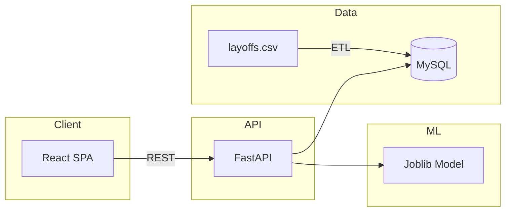

# Architecture

## Overview

The **Global Layoff Intelligence Platform** is a full-stack analytics and ML dashboard. It ingests layoff CSV data, cleans and stores it in MySQL, exposes REST APIs for analytics and prediction, and serves a React frontend with charts, filters, and a risk prediction form.

## High-Level Components

```
┌─────────────────────────────────────────────────────────────────────────┐
│                           React Frontend (Vite)                           │
│  Dashboard │ Trends │ Company Analysis │ Risk Prediction │ Leaflet Map   │
└─────────────────────────────────────────────────────────────────────────┘
                                      │
                                      │ HTTP / REST (Axios)
                                      ▼
┌─────────────────────────────────────────────────────────────────────────┐
│                         FastAPI Backend (Uvicorn)                        │
│  /api/overview │ /api/trends │ /api/companies │ /api/predict │ /api/auth  │
│  /api/reports/pdf │ /api/reports/eda                                       │
└─────────────────────────────────────────────────────────────────────────┘
                    │                                    │
                    │ SQLAlchemy                         │ joblib
                    ▼                                    ▼
┌──────────────────────────────┐    ┌──────────────────────────────────────┐
│         MySQL                 │    │  ML Pipeline (train.py / predictor.py) │
│  layoff_records               │    │  LogisticRegression / RandomForest     │
│  (cleaned layoff events)      │    │  Risk: High / Medium / Low             │
└──────────────────────────────┘    └──────────────────────────────────────┘
                    ▲
                    │ ETL on startup
┌──────────────────────────────┐
│  backend/data/layoffs.csv     │
│  (or project data/layoffs)   │
└──────────────────────────────┘
```

## Data Flow

1. **Ingest**: On backend startup, `data_loader.py` reads `layoffs.csv`, cleans (dates, nulls, duplicates), and syncs into MySQL `layoff_records`.
2. **Analytics**: Frontend and external clients call `/api/overview`, `/api/trends`, `/api/companies` (with optional filters). Backend queries MySQL and returns JSON.
3. **Prediction**: User submits industry, country, and funds_raised to `/api/predict`. Backend loads the joblib-trained model (or trains on first use), encodes features, and returns risk level (High / Medium / Low).
4. **Auth**: User logs in via `/api/auth/login`; JWT is stored and sent with requests. Frontend protects routes and sends `Authorization: Bearer <token>`.

## Technology Summary

| Layer | Technologies |
|-------|--------------|
| Frontend | React 18, Vite, TailwindCSS, Recharts, React Router, Axios, Leaflet / react-leaflet |
| Backend | FastAPI, Uvicorn, Pydantic, SQLAlchemy, Pandas |
| Database | MySQL (PyMySQL driver) |
| ML | Scikit-learn (LogisticRegression, RandomForest), joblib |
| Auth | JWT (python-jose), bcrypt (passlib) |
| Reports | ReportLab (PDF), Pandas (EDA summary) |

## Text-Based Architecture Diagram (Mermaid)



For more detail on each component, see [Backend](backend.md) and [Frontend](frontend.md).
